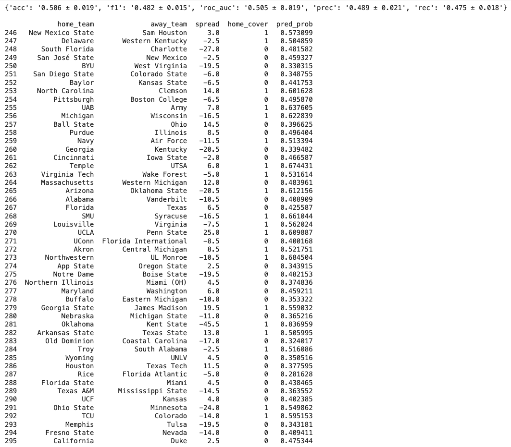

# College Football Against the Spread Picker
This repo is for producing datasets and machine learning models to pick college football games against the spread

# Understanding
The primary file is [here](/data/notebooks/hate_watch_ATS_data_file.ipynb)

# Current Status
I'm currently focusing on building out my [API](https://github.com/lukes415/cfb-ats-api) so that I can separate dataset creation from data querying logic. 

# Data Source
We pull, clean, and manipulate data from:
- [College Football Data](https://collegefootballdata.com)

# Goal
- [ ] Engineer features to predict ATS outcomes using ingested CFB data
- [ ] Create baseline models, evaluate vs. obvious heuristics and try to improve upon them
- [ ] Integrate dataset and models with an iOS app to help users enjoy college football weekends more
- [ ] See if my model can outperform me in my pickem league. I usually come in the top third of the league
- [ ] Have fun :grin:

# Completed
- [x] Update the dataset to include conference flags, timezone deltas, and coaching tenure deltas
- [x] Check how many records are missing specific datapoints and try to decide on reasonable substitutions

# In Progress
- [ ] Further interrogate feature importances, and determine whether the COVID year is too much of a wildcard
- [ ] Iterate on feature engineering

# Updates
With ~50% accuracy, the random forest model with encoded team IDs actually performs worse than some of the initial baselines. Here are the Week 6 picks as of now:

